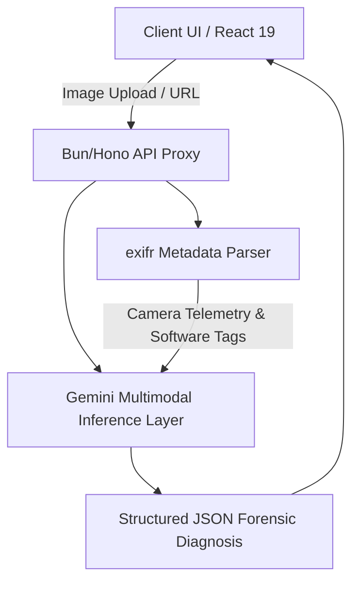

# 🔍 Forensiq (DeepDetect)

> **State-of-the-Art Authentication Terminal for Synthetic Media**

[](https://deepdetect-ten.vercel.app/)
[](https://deepdetect-ten.vercel.app/)
[](https://deepdetect-ten.vercel.app/)
[](https://deepdetect-ten.vercel.app/research)

Forensiq is an advanced digital image forensics terminal designed to detect, analyze, and demystify synthetic and manipulated media. By fusing low-level photographic metadata analysis with state-of-the-art multimodal AI inference, Forensiq delivers highly accurate and explainable verdicts—classifying media as **Authentic**, **Synthetic**, or **Uncertain** with fine-grained evidence mapping.

🔗 **Explore the Live Application:** [deepdetect-ten.vercel.app](https://deepdetect-ten.vercel.app/)

---

## 🌟 Key Capabilities

### 1. Multi-Channel Forensic Analysis
The analysis engine scrutinizes media across five vital dimensions of authenticity:
*   **Lighting Consistency:** Detects incongruous light sources, missing contact/cast shadows, and mismatched specular highlights on eyes and skin.
*   **Geometric Fidelity:** Identifies anatomical and architectural anomalies, such as impossible joints, merged digits, or warped repeating patterns.
*   **Frequency-Domain Analysis:** Probes for residual noise signatures, GAN-grid pixel hatching, or diffusion-pattern textures.
*   **Compression & Resizing Profiles:** Evaluates JPEG blocking, metadata anomalies, and noise-floor discrepancies indicative of editing or post-processing.
*   **Semantic Integrity:** Scans for structural anomalies, impossible physics, and perspective/focus shifts.

### 2. Low-Level EXIF Pre-Extraction
Before AI analysis occurs, the backend extracts comprehensive EXIF camera telemetry:
*   Original capture hardware (Make, Model, Lens dimensions).
*   Camera exposure metrics (ISO speed, Aperture $f$-number, Exposure time).
*   Software signatures (Flags software footprints of generative packages or editor programs like Stable Diffusion, Photoshop, Firefly, Midjourney).
*   Telemetry tags (capture time and GPS coordinates) to establish physical chain of custody.

### 3. Explainable Forensic Reports
Every analysis returns a complete diagnostic report containing:
*   **Decisive Verdict:** Categorical output with a calibrated confidence score.
*   **Plain-English Executive Summary:** A clear, jargon-free one-liner for rapid assessment.
*   **Detailed Forensic Rationale:** A thorough breakdown of the optical and technical signals.
*   **Exact Marked Artifacts:** Concrete evidence items identified (e.g., "Mismatched iris geometry in the left eye").
*   **Actionable Recommendation:** Practical advisory guidance on how to handle and interpret the verdict.

---

## 🔬 Scientific Foundation

Forensiq is backed by academic research conducted at the **Department of Computer Science and Engineering, MGM's College of Engineering and Technology, Noida, India**. The terminal integrates two progressive academic frameworks:

### [Paper 1] Deepfake Image Detection — Real or Fake
*   **Focus:** A high-efficiency, lightweight Convolutional Neural Network (CNN) framework designed for real-time edge processing.
*   **Key Results:** Achieves **96.8% classification accuracy** on the *FaceForensics++* benchmark with a **95.2% recall** rate. Optimizes spatial processing via specialized face alignment and data augmentation.

### [Paper 2] Hybrid CNN-Transformer with Multimodal Fusion
*   **Focus:** An advanced continuation study combining CNNs (for local texture extraction) with Transformer multi-head attention (for capturing global geometric relationships).
*   **Key Results:** Achieves **97.2% classification accuracy** with a ultra-low latency of **28ms**, outperforming MesoNet, XceptionNet, and standard Capsule Networks. Includes Explainable AI (XAI) overlays (Grad-CAM and SHAP) for full transparency.

---

## 💻 Tech Stack & Architecture



*   **Frontend:** React 19, Vite, TypeScript, Tailwind CSS v4, Motion (dynamic, editorial-grade typographic layout with micro-animations).
*   **Backend:** Bun Runtime, Hono Web Framework, `exifr` (high-performance EXIF reader), Google Gemini Multimodal APIs.

---

## 🚀 Local Development Setup

Ensure you have [Bun](https://bun.sh/) installed on your machine.

### 1. Configure the Backend
1. Navigate to the backend directory:
   ```bash
   cd backend
   ```
2. Copy the example environment template:
   ```bash
   cp .env.example .env
   ```
3. Open `.env` and fill in your Gemini API key:
   ```env
   FORENSIQ_INFERENCE_KEY=your_gemini_api_key
   FORENSIQ_INFERENCE_MODEL=gemini-2.5-flash
   PORT=8787
   ```
4. Install dependencies and start the development server:
   ```bash
   bun install
   ```
   ```bash
   bun dev
   ```

The backend server will spin up on `http://localhost:8787`.

### 2. Configure the Frontend
1. Navigate to the frontend directory:
   ```bash
   cd ../frontend
   ```
2. Install dependencies:
   ```bash
   bun install
   ```
3. Run the Vite development server:
   ```bash
   bun dev
   ```


---

## 📡 API Reference

### Health Check
`GET /api/health`
*   **Description:** Returns API operational status, configured model, and API key availability.
*   **Response:**
    ```json
    {
      "ok": true,
      "model": "gemini-2.5-flash",
      "keyPresent": true
    }
    ```

### Image Analysis
`POST /api/analyze`
*   **Description:** Submits an image for comprehensive forensic inspection. Supports both binary file upload and remote URL fetching.
*   **Payload (JSON - Remote URL):**
    ```json
    {
      "url": "https://example.com/suspicious-image.jpg"
    }
    ```
*   **Payload (Form Data - Direct Upload):**
    *   `image`: Binary file (JPEG, PNG, WebP up to 8MB)
*   **Response (JSON Schema):**
    ```json
    {
      "verdict": "SYNTHETIC",
      "confidence": 92,
      "oneLiner": "The image exhibits unnatural hand structures and inconsistent light sourcing.",
      "reasoning": "Forensic analysis detected six digits on the subject's left hand along with anatomical fusion. The background exhibits structural melting in the window panes...",
      "signals": [
        { "label": "Lighting", "status": "flagged", "detail": "Illumination angle disagrees with cast shadow directions." },
        { "label": "Geometry", "status": "flagged", "detail": "Anatomical anomaly detected on hands." },
        { "label": "Frequency", "status": "clean", "detail": "Texture noise floor falls within standard deviation limits." },
        { "label": "Compression", "status": "neutral", "detail": "Compression blocks are consistent." },
        { "label": "Semantics", "status": "flagged", "detail": "Subject composition shows high-order conceptual alignment." }
      ],
      "artifacts": ["Six digits on left hand", "Asymmetric eye pupil reflections", "Melted structural window frame"],
      "recommendation": "Highly recommend treating this image as synthetic...",
      "metadataNote": "EXIF metadata is absent, which is atypical for a photo claiming to be a raw camera capture.",
      "metadata": { ... }
    }
    ```

---

## 👥 Contributors

*   **Krish Lal Srivastava** (Dept. of CSE, MGM's College of Engineering and Technology)
*   **Diksha Asnora** (Dept. of CSE, MGM's College of Engineering and Technology)
*   **Harshit Mehra** (Dept. of CSE, MGM's College of Engineering and Technology)
*   **Shreya Gupta** (Dept. of CSE, MGM's College of Engineering and Technology)
*   **Mr. Abhishek Chaudhary** (Project Guide / Faculty, Dept. of CSE)
